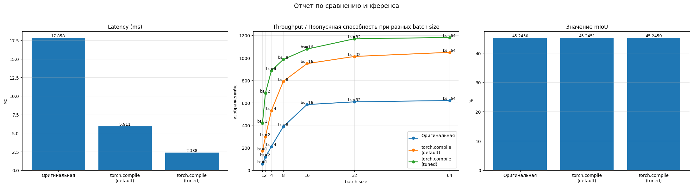
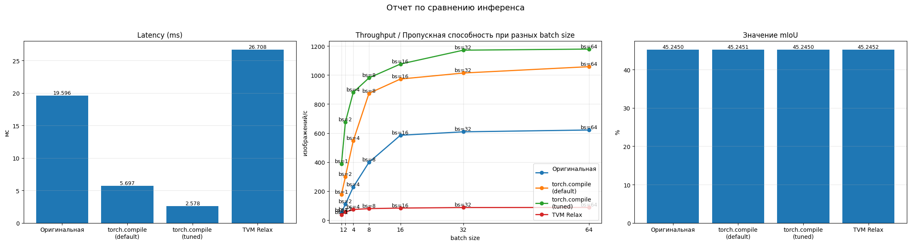

# Анализ вычислительных затрат инференса
TODO: добавить результаты профилирования   

# Результаты экспериментов
TODO: по мере проведения экспериментов добавлять информацию
1. Компиляторные оптимизации

2. Квантизация / прунинг
